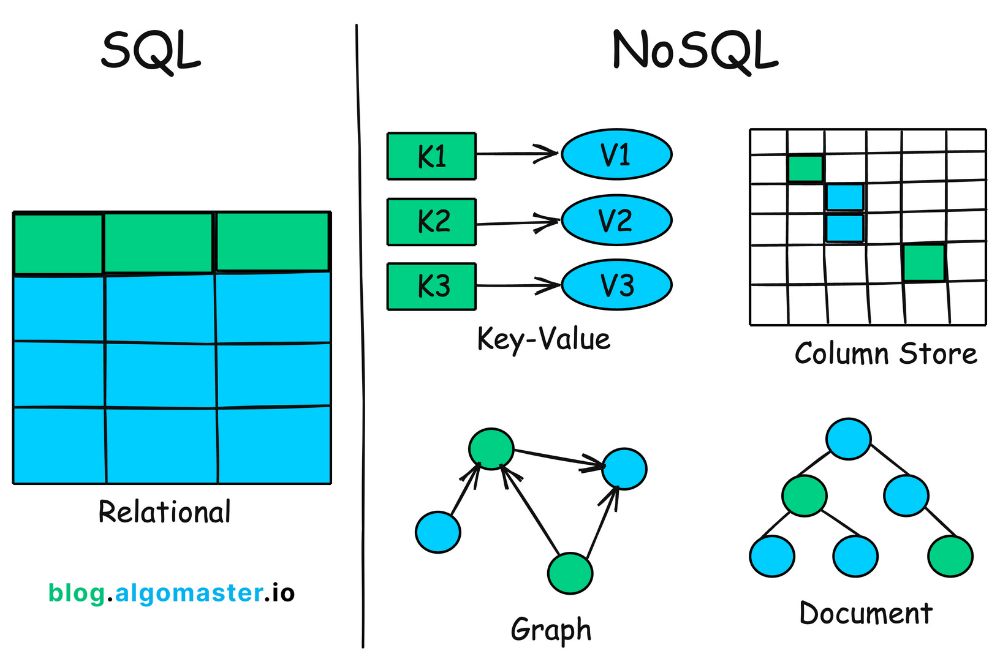
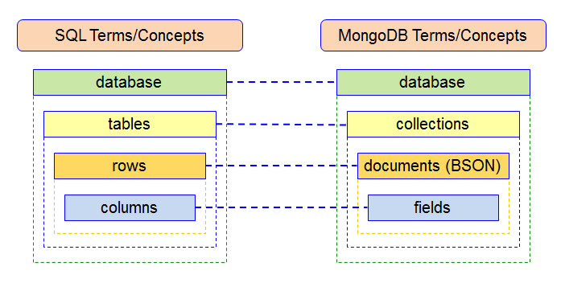
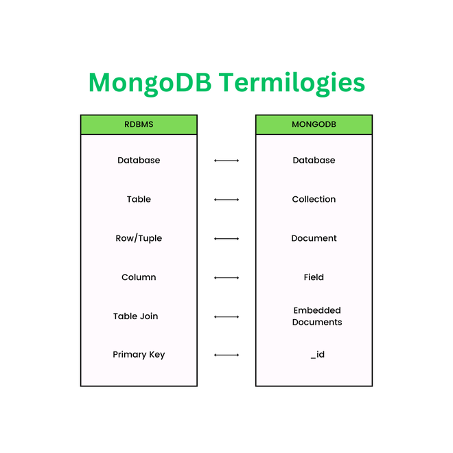

## What is MongoDB?
- MongoDB is document based NoSQL Database. Most widely used NoSQL Database in the world.
- Stores Data in JSON like documents. (BSON)
- Very flexible structure to store the data
- Large amount of data can be  easily managed.
- It is being used by well known companies like google, adobe, cisco SAP, eBay.

## SQL VS NoSQL
SQL databases are vertically scalable, while NoSQL databases are horizontally scalable. SQL databases are table-based, while NoSQL databases are document, key-value, graph, or wide-column stores. SQL databases are better for multi-row transactions, while NoSQL is better for unstructured data like documents or JSON.


## SQL Structure
The structure of SQL (Structured Query Language) includes tables, columns, rows, and SQL queries. SQL is a programming language that allows users to manage and manipulate relational databases.

### Tables
- The foundation of SQL, tables store data in rows and columns
- Each table has a physical representation of data
 
### Columns
- The fields in a table that define the types of data stored
- Each column has a specific data type, such as INTEGER, VARCHAR, or DATE

### Rows
- Each row contains all the information about a single record
  
### SQL queries
- The basic structure of an SQL query includes a SELECT clause, a FROM clause, and an optional WHERE clause
- Other components of an SQL query include GROUP BY, ORDER BY, and LIMIT

### SQL commands
- Data Definition Language (DDL) commands are used to build, change, and delete database structures
- Data Manipulation Language (DML) commands are used to store, update, remove, search, and retrieve information from the database 

## MongoDB Terms




## MongoDB Collection Example

```JSON
{
  "_id": ObjectId("63fce3a9e72c4b3a9b9e1b34"),
  "title": "1984",
  "genre": "Dystopian",
  "publishDate": ISODate("1949-06-08T00:00:00Z"),
  "author": {
    "firstName": "George",
    "lastName": "Orwell",
    "birthDate": ISODate("1903-06-25T00:00:00Z"),
    "nationality": "British"
  },
  "availability": {
    "totalCopies": 5,
    "borrowedCopies": 2
  },
  "borrowRecords": [
    {
      "memberId": ObjectId("63fce4a9c71a4b8f9d1c3e1f"),
      "borrowDate": ISODate("2023-01-15T00:00:00Z"),
      "returnDate": null
    },
    {
      "memberId": ObjectId("63fce4c2d92a4b5f7e1f3e21"),
      "borrowDate": ISODate("2023-01-20T00:00:00Z"),
      "returnDate": ISODate("2023-02-01T00:00:00Z")
    }
  ]
}

```
### Explanation
1. **Document Structure:** MongoDB uses JSON-like documents (`key-value pairs`) stored in collections.
2. **Nested Objects**: The `author` and `availability` fields are nested objects.
3. **Array Fields**: `borrowRecords` is an array of objects representing borrowing transactions.
4. **Data Types**: MongoDB supports `ObjectId`, `ISODate`, numbers, strings, etc.


